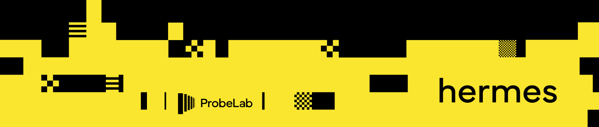

# Hermes

[](https://probelab.io)
[](https://github.com/probe-lab/hermes/actions)
[](https://pkg.go.dev/github.com/probe-lab/hermes)

Hermes is a GossipSub listener and tracer. It subscribes to all relevant pubsub topics
and traces all protocol interactions. As of `2024-05-21`, Hermes supports the Ethereum
network.

## Table of Contents

- [Hermes](#hermes)
  - [Table of Contents](#table-of-contents)
  - [Installation](#installation)
  - [Developing](#developing)
    - [CLI Arguments](#cli-arguments)
  - [Deployment](#deployment)
    - [General](#general)
    - [Ethereum](#ethereum)
      - [Subnet Configuration](#subnet-configuration)
      - [Topic Subscription](#topic-subscription)
  - [Telemetry](#telemetry)
    - [Metrics](#metrics)
    - [Tracing](#tracing)
  - [Differences with other tools](#differences-with-other-tools)
  - [Maintainers](#maintainers)
  - [Contributing](#contributing)
  - [License](#license)

## Installation

```sh
go install github.com/probe-lab/hermes@latest
```

## Developing

Check out the repository:

```shell
git clone git@github.com:probe-lab/hermes.git
```

Start Hermes by running

```shell
go run ./cmd/hermes # requires Go >=1.23
```

<details>
<summary>This should print this help text</summary>

```text
NAME:
   hermes - a gossipsub listener

USAGE:
   hermes [global options] command [command options]

COMMANDS:
   eth, ethereum  Listen to gossipsub topics of the Ethereum network
   benchmark      performs the given set of benchmarks for the hermes internals
   help, h        Shows a list of commands or help for one command

GLOBAL OPTIONS:
   --help, -h  show help

   DataStream Configuration:

   --aws.key.id value         Access key ID of the AWS account for the s3 bucket [$HERMES_AWS_ACCESS_KEY_ID]
   --aws.secret.key value     Secret key of the AWS account for the S3 bucket [$HERMES_AWS_SECRET_KEY]
   --data.stream.type value   Format where the traces will be submitted: logger, kinesis, or callback. (default: "logger") [$HERMES_DATA_STREAM_TYPE]
   --kinesis.region value     The region of the AWS Kinesis Data Stream [$HERMES_KINESIS_REGION]
   --kinesis.stream value     The name of the AWS Kinesis Data Stream [$HERMES_KINESIS_DATA_STREAM]
   --s3.bucket value          Name of the S3 bucket that will be used as reference to submit the traces (default: "hermes") [$HERMES_S3_BUCKET]
   --s3.byte.limit value      Soft upper limit of bytes for the S3 dumps (default: 10485760) [$HERMES_S3_BYTE_LIMIT]
   --s3.endpoint value        The endpoint of our custom S3 instance to override the AWS defaults [$HERMES_S3_CUSTOM_ENDPOINT]
   --s3.flush.interval value  Minimum time interval at which the batched traces will be dump in S3 (default: 2s) [$HERMES_S3_FLUSH_INTERVAL]
   --s3.flushers value        Number of flushers that will be spawned to dump traces into S3 (default: 2) [$HERMES_S3_FLUSHERS]
   --s3.region value          The name of the region where the s3 bucket will be stored [$HERMES_S3_REGION]

   Logging Configuration:

   --log.format value  Sets the format to output the log statements in: text, json, hlog, tint (default: "hlog") [$HERMES_LOG_FORMAT]
   --log.level value   Sets an explicity logging level: debug, info, warn, error. Takes precedence over the verbose flag. (default: "info") [$HERMES_LOG_LEVEL]
   --log.nocolor       Whether to prevent the logger from outputting colored log statements (default: false) [$HERMES_LOG_NO_COLOR]
   --log.source        Compute the source code position of a log statement and add a SourceKey attribute to the output. Only text and json formats. (default: false) [$HERMES_LOG_SOURCE]
   --verbose, -v       Set logging level more verbose to include debug level logs (default: false) [$HERMES_VERBOSE]

   Telemetry Configuration:

   --metrics             Whether to expose metrics information (default: false) [$HERMES_METRICS_ENABLED]
   --metrics.addr value  Which network interface should the metrics endpoint bind to. (default: "localhost") [$HERMES_METRICS_ADDR]
   --metrics.port value  On which port should the metrics endpoint listen (default: 6060) [$HERMES_METRICS_PORT]
   --tracing             Whether to emit trace data (default: false) [$HERMES_TRACING_ENABLED]
   --tracing.addr value  Where to publish the traces to. (default: "localhost") [$HERMES_TRACING_ADDR]
   --tracing.port value  On which port does the traces collector listen (default: 4317) [$HERMES_TRACING_PORT]
```

</details>

### CLI Arguments

We use dot notation to namespace command line arguments instead of hyphens because [the CLI library](https://github.com/urfave/cli) allows
to configuration parameters from a file which will then resolve the command line parameters. For example,
the CLI flag `--log.format` could be read from a yaml file that looks like this:

```yaml
log:
  format: json
```

_However_, Hermes currently doesn't support loading CLI arguments from a file ¯\_(ツ)_/¯.

## Deployment

Depending on the network you want to trace Hermes requires auxiliary infrastructure.
As of `2024-03-27`, Hermes supports these networks:

- [Ethereum](#ethereum)

### General

There are different ways of keeping track of the events that Hermes generates:
- [AWS Kinesis](https://aws.amazon.com/kinesis/). We're using our [own producer library](https://github.com/dennis-tra/go-kinesis) to do that.
    - In order to hook up Hermes with AWS Kinesis you need to provide the following command line flags:
        - `--data.stream.type="kinesis"`
        - `--kinesis.region=us-east-1` # just an example
        - `--kinesis.stream=$YOUR_DATA_STREAM_NAME`
    - If the name is set, Hermes will start pumping events to that stream.

> It's important to note that the events **will not** be strictly ordered. They will only follow a lose ordering. The reasons are 1) potential retries of event submissions and 2) [record aggregation](https://docs.aws.amazon.com/streams/latest/dev/kinesis-kpl-concepts.html#kinesis-kpl-concepts-aggretation). Depending on the configured number of submission retries the events should be ordered within each 30s time window.
- [S3](https://aws.amazon.com/s3/). Hermes will batch the traces, format them into a parquet file, and submit them to the given S3 Bucket. These are the flags that should be provided:
    - `--data.stream.type="s3"`
    - `--s3.region="us-east-1"` # just an example
    - `--s3.endpoint=""` # only for local testing
    - `--s3.bucket=$YOUR_S3_BUCKET_KEY`
    - `--s3.tag="hermes"` # preferred bucket key used to reference the traces
    - `--s3.byte.limit=1269760` # 10MB is the default
    - `--s3.flushers=2` # 2 is the default
    - `--s3.flush.interval="2s"` # 2s is the default
    - `--aws.key.id=$YOUR_AWS_KEY_ID` # only necessary for private buckets
    - `--aws.secret.key=$YOUR_AWS_SECRET_KEY` # only necessary for private buckets


- `Code Callbacks`. Hermes will execute the given callback functions whenever an event is traced.
    - `--data.stream.type="callback"`
- `Logger`. Hermes will print the JSON formatted traces into `stdout` in a log format (ideal for local testing).
    - `--data.strea.type="logger"`

_Note: we provide a local s3 setup to use if needed. The configuration of the `localstack s3` instance can be tunned using a copy (`.env`) of the `.env.template` file, which will be read by default when doing `docker compose up s3`. Make sure that the docker container is up running when launching the `hermes` instance._

### Ethereum

In order to run Hermes in the Ethereum network you are required to run a Prysm beacon node. Hermes requires Prysm over other implementations because as far as [I](https://github.com/dennis-tra) know it's the only implementation that allows dynamic registration of trusted peers. For example, Lighthouse requires the list of trusted peers at boot time.

Further, Hermes requires beacon node in general because it delegates certain requests to it. In the case of the Ethereum network Hermes forwards all requests for the following protocols:

- `/eth2/beacon_chain/req/beacon_blocks_by_range/2/ssz_snappy`
- `/eth2/beacon_chain/req/beacon_blocks_by_root/2/ssz_snappy`
- `/eth2/beacon_chain/req/blob_sidecars_by_range/1/ssz_snappy`
- `/eth2/beacon_chain/req/blob_sidecars_by_root/1/ssz_snappy`

These request handlers require knowledge of the chain state wherefore Hermes cannot handle them itself. Still, they are required to be a good citizen of the network and not get pruned by other peers.

#### Subnet Configuration

Hermes supports configuring which subnets to subscribe to for each topic type (attestation, sync committee, and blob sidecar). This can be useful to:
- Reduce resource usage by subscribing to fewer subnets
- Target specific subnets for analysis
- Distribute monitoring across multiple Hermes instances

When creating a Node, you can configure the subnets using the `SubnetConfigs` field:

```go
// Create a configuration map for different subnet topics
cfg.SubnetConfigs = map[string]*eth.SubnetConfig{
    // Subscribe to specific attestation subnets
    p2p.GossipAttestationMessage: {
        Type: eth.SubnetStatic,
        Subnets: []uint64{0, 1, 5, 44},
    },
    
    // Subscribe to all sync committee subnets (this is the default if no config provided)
    p2p.GossipSyncCommitteeMessage: {
        Type: eth.SubnetAll,
    },
    
    // Subscribe to a random set of blob sidecar subnets
    p2p.GossipBlobSidecarMessage: {
        Type: eth.SubnetRandom,
        Count: 2,
    },
}
```

For each topic that supports subnets, you can use one of these configuration strategies:

1. **Subscribe to all subnets** (default if no config provided)
   ```go
   topicConfig := &eth.SubnetConfig{
       Type: eth.SubnetAll,
   }
   ```

2. **Subscribe to specific subnets**
   ```go
   topicConfig := &eth.SubnetConfig{
       Type: eth.SubnetStatic,
       Subnets: []uint64{0, 1, 5, 44},
   }
   ```

3. **Subscribe to a random set of subnets**
   ```go
   topicConfig := &eth.SubnetConfig{
       Type: eth.SubnetRandom,
       Count: 8, // Number of subnets to randomly select
   }
   ```

4. **Subscribe to a range of subnets**
   ```go
   topicConfig := &eth.SubnetConfig{
       Type: eth.SubnetStaticRange,
       Start: 0,
       End: 32, // End is exclusive
   }
   ```

#### Topic Subscription

In addition to subnet configuration, Hermes allows you to specify exactly which topics to subscribe to using the `--subscription.topics` flag. This gives you fine-grained control over which message types Hermes will monitor.

By default, Hermes subscribes to all standard topics:
- Block messages
- Aggregate and proof messages
- Attestation messages
- Attester slashing messages
- Proposer slashing messages
- Contribution and proof messages
- Sync committee messages
- BLS to execution change messages
- Blob sidecar messages

To subscribe to only specific topics, use the `--subscription.topics` flag with a comma-separated list:

```shell
hermes eth --subscription.topics="beacon_attestation,beacon_block"
```

This configuration allows you to set up multiple Hermes instances that monitor different parts of the network, or to focus monitoring on specific subnets and topics of interest.

To run Hermes for the Ethereum network you would need to point it to the beacon node by providing the

- `--local.trusted.address=true` # when the Prysm node is running in the same machine (localhost)
- `--prysm.host=1.2.3.4`
- `--prysm.port.http=3500` # 3500 is the default
- `--prysm.port.grpc=4000` # 4000 is the default

If your Prysm node requires basic authentication, you can include the credentials in the host parameter:
- `--prysm.host=username:password@1.2.3.4`

If your password contains special characters, make sure to URL encode them:
- `--prysm.host=username:my%40special%3Apass@1.2.3.4` # for password 'my@special:pass'

command line flags to the `hermes ethereum` subcommand. Check out the help page via `hermes ethereum --help` for configuration options of the libp2p host or devp2p local node (e.g., listen addrs/ports).

<details>
<summary>Hermes' Ethereum Help Page</summary>

```text
NAME:
   hermes eth - Listen to gossipsub topics of the Ethereum network

USAGE:
   hermes eth command [command options]

COMMANDS:
   ids          generates peer identities in csv format
   chains       List all supported chains
   fork-digest  Compute and display the fork digest for any eth-cl-network
   help, h      Shows a list of commands or help for one command

OPTIONS:
   --key value, -k value                                                          The private key for the hermes libp2p/ethereum node in hex format. [$HERMES_ETH_KEY]
   --chain value                                                                  The beacon chain to participate in. (default: "mainnet") [$HERMES_ETH_CHAIN]
   --attnets value, -a value                                                      The attestation network digest. (default: "ffffffffffffffff") [$HERMES_ETH_ATTNETS]
   --dial.concurrency value                                                       The maximum number of parallel workers dialing other peers in the network (default: 16) [$HERMES_ETH_DIAL_CONCURRENCY]
   --dial.timeout value                                                           The request timeout when contacting other network participants (default: 5s) [$HERMES_ETH_DIAL_TIMEOUT]
   --devp2p.host value                                                            Which network interface should devp2p (discv5) bind to. (default: "127.0.0.1") [$HERMES_ETH_DEVP2P_HOST]
   --devp2p.port value                                                            On which port should devp2p (disv5) listen (default: random) [$HERMES_ETH_DEVP2P_PORT]
   --libp2p.host value                                                            Which network interface should libp2p bind to. (default: "127.0.0.1") [$HERMES_ETH_LIBP2P_HOST]
   --libp2p.port value                                                            On which port should libp2p (disv5) listen (default: random) [$HERMES_ETH_LIBP2P_PORT]
   --libp2p.peerscore.snapshot.frequency value                                    Frequency at which GossipSub peerscores will be accessed (in seconds) (default: random) [$HERMES_ETH_LIBP2P_PEERSCORE_SNAPSHOT_FREQUENCY]
   --local.trusted.addr                                                           To advertise the localhost multiaddress to our trusted control Prysm node (default: false) [$HERMES_ETH_LOCAL_TRUSTED_ADDRESS]
   --prysm.host value                                                             The host ip/name where Prysm's (beacon) API is accessible [$HERMES_ETH_PRYSM_HOST]
   --prysm.port.http value                                                        The port on which Prysm's beacon nodes' Query HTTP API is listening on (default: 3500) [$HERMES_ETH_PRYSM_PORT_HTTP]
   --prysm.port.grpc value                                                        The port on which Prysm's gRPC API is listening on (default: 4000) [$HERMES_ETH_PRYSM_PORT_GRPC]
   --max-peers value                                                              The maximum number of peers we want to be connected with (default: 30) [$HERMES_ETH_MAX_PEERS]
   --genesis.ssz.url value                                                        The .ssz URL from which to fetch the genesis data, requires 'chain=devnet' [$HERMES_ETH_GENESIS_SSZ_URL]
   --config.yaml.url value                                                        The .yaml URL from which to fetch the beacon chain config, requires 'chain=devnet' [$HERMES_ETH_CONFIG_URL]
   --bootnodes.yaml.url value                                                     The .yaml URL from which to fetch the bootnode ENRs, requires 'chain=devnet' [$HERMES_ETH_BOOTNODES_URL]
   --deposit-contract-block.txt.url value                                         The .txt URL from which to fetch the deposit contract block. Requires 'chain=devnet' [$HERMES_ETH_DEPOSIT_CONTRACT_BLOCK_URL]
   --subscription.topics value [ --subscription.topics value ]                    Comma-separated list of topics to subscribe to (e.g. beacon_attestation,beacon_block) [$HERMES_ETH_SUBSCRIPTION_TOPICS]
   --subnet.attestation.type value                                                Subnet selection strategy for attestation topics (all, static, random, static_range) (default: "all") [$HERMES_ETH_SUBNET_ATTESTATION_TYPE]
   --subnet.attestation.subnets value [ --subnet.attestation.subnets value ]      Comma-separated list of subnet IDs for attestation when type=static [$HERMES_ETH_SUBNET_ATTESTATION_SUBNETS]
   --subnet.attestation.count value                                               Number of random attestation subnets to select when type=random (default: 0) [$HERMES_ETH_SUBNET_ATTESTATION_COUNT]
   --subnet.attestation.start value                                               Start of subnet range (inclusive) for attestation when type=static_range (default: 0) [$HERMES_ETH_SUBNET_ATTESTATION_START]
   --subnet.attestation.end value                                                 End of subnet range (exclusive) for attestation when type=static_range (default: 0) [$HERMES_ETH_SUBNET_ATTESTATION_END]
   --subnet.synccommittee.type value                                              Subnet selection strategy for sync committee topics (all, static, random, static_range) (default: "all") [$HERMES_ETH_SUBNET_SYNCCOMMITTEE_TYPE]
   --subnet.synccommittee.subnets value [ --subnet.synccommittee.subnets value ]  Comma-separated list of subnet IDs for sync committee when type=static [$HERMES_ETH_SUBNET_SYNCCOMMITTEE_SUBNETS]
   --subnet.synccommittee.count value                                             Number of random sync committee subnets to select when type=random (default: 0) [$HERMES_ETH_SUBNET_SYNCCOMMITTEE_COUNT]
   --subnet.synccommittee.start value                                             Start of subnet range (inclusive) for sync committee when type=static_range (default: 0) [$HERMES_ETH_SUBNET_SYNCCOMMITTEE_START]
   --subnet.synccommittee.end value                                               End of subnet range (exclusive) for sync committee when type=static_range (default: 0) [$HERMES_ETH_SUBNET_SYNCCOMMITTEE_END]
   --subnet.blobsidecar.type value                                                Subnet selection strategy for blob sidecar topics (all, static, random, static_range) (default: "all") [$HERMES_ETH_SUBNET_BLOBSIDECAR_TYPE]
   --subnet.blobsidecar.subnets value [ --subnet.blobsidecar.subnets value ]      Comma-separated list of subnet IDs for blob sidecar when type=static [$HERMES_ETH_SUBNET_BLOBSIDECAR_SUBNETS]
   --subnet.blobsidecar.count value                                               Number of random blob sidecar subnets to select when type=random (default: 0) [$HERMES_ETH_SUBNET_BLOBSIDECAR_COUNT]
   --subnet.blobsidecar.start value                                               Start of subnet range (inclusive) for blob sidecar when type=static_range (default: 0) [$HERMES_ETH_SUBNET_BLOBSIDECAR_START]
   --subnet.blobsidecar.end value                                                 End of subnet range (exclusive) for blob sidecar when type=static_range (default: 0) [$HERMES_ETH_SUBNET_BLOBSIDECAR_END]
   --help, -h                                                                     show help
```

</details>


## Telemetry

### Metrics

When you provide the `--metrics` command line flag Hermes will expose a Prometheus HTTP endpoint at `localhost:6060`. Host and port are configurable via `--metrics.addr` and `--metrics.port`.

### Tracing

Run an OpenTelemetry Collector compatible trace collector like Jaeger:

```shell
docker run --name jaeger \
  -e COLLECTOR_OTLP_ENABLED=true \
  -p 16686:16686 \
  -p 4317:4317 \
  --rm jaegertracing/all-in-one:1.54
```

You can find the UI at [`http://localhost:16686`](http://localhost:16686). Port `4317` is used by Hermes to export traces to.

Run Hermes with the `--tracing` flag. To change the address of the trace collector, you can also specify `--tracing.addr` and `--tracing.port`.

## Differences with other tools
Hermes jumps to the web3/blockchain/libp2p ecosystem despite a large variety of tools around it, such as the many existing network crawlers or light clients for most mature networks. Although at first sight it might look like a competitor to those, there was still a large incentive to develop it. Here, we describe the gap that Hermes fills as well as the use-cases that it is suitable for.
Hermes was designed to behave as a light node in each supported network, where, in addition to being an honest participant in the network and supporting all the protocols and RPC endpoints, it also allows streaming of custom internal events (mostly libp2p-related).

Hermes avoids being based on a custom fork of existing full/light clients, which would come with non-negligible maintenance baggage and would complicate having control of events.

Currently available similar tools:

### Armiarma Crawler from MigaLabs vs Hermes from ProbeLab
Although both Hermes and Armiarma seem to be focusing on the same goals at first sight, they have significant differences in their use cases and their targets in data collection and metrics.

[Armiarma](https://github.com/migalabs/armiarma) is a network crawler that relies on running discv5 peer discovery service and a libp2p host 24/7 to establish connections. However, significant modifications have been made to connect to as many peers as possible (custom peering module). This way, it tries to identify as many peers as possible in the network periodically. Thus, its focus is mainly on opening and identifying as many peers as possible, rather than maintaining stable connections to other peers in the network.

On the other hand, although Hermes also relies on a continuously running discv5 and libp2p host, it uses the libp2p connection manager for a different purpose to Armiarma (which is to connect to as many peers as possible). In the case of Hermes, the connection manager is used to decide who it connects to (i.e., simulating the behaviour of a standard node). Furthermore, it backs up some of the RPC, which requires keeping the chain db calls on a trusted node. This way, it behaves like a light node to the network, which is honest and beneficial for the rest of the network, allowing us to track all desired networking events from stable connections, while at the same time having a highly customizable tracing system.

## Maintainers

- [Dennis Trautwein](https://github.com/dennis-tra)
- [Mikel Cortes](https://github.com/cortze)
- [Guillaume Michel](https://github.com/guillaumemichel)

## Contributing

Contributions are welcome!

Please take a look at [the issues](https://github.com/probe-lab/hermes/issues).

## License

[SPDX-License-Identifier: Apache-2.0 OR MIT](LICENSE.md)
